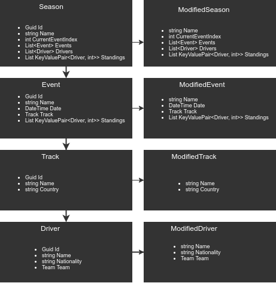

## ASG-Leaderboard-Project

####  Tekijät: __Samuli Salin, Teemu Pullinen, Arttu Salin__

# Moottoriurheiluun soveltuva leaderboardsimulaatio- toteutus MongoDB:n avulla

### Yleiskatsaus

__Projektin tavoitteena oli luoda moottoriurheiluun soveltuva leaderboard, joka sisältää myös kausien ja kilpailuiden simulaatiotoiminnallisuutta.__ Halusimme, että käyttäjä pystyy simuloimaan ja tarkastelemaan kauden tapahtumia ja tarkastella kauden sen hetkistä tilannetta helposti ymmärrettävässä muodossa.

Käyttäjä voi HTTP-pyyntöjen avulla muokata MongoDB tietokantaa, luoden esimerkiksi kausia, kilpailuita, ja kuljettajia.

Projektin avulla pyrimme osoittamaan että olemme sisäistäneet kurssilla läpikäytyjä aihekokonaisuuksia, kuten ASP.NET Coren ominaisuuksien käyttäminen, datan säilöminen/käsitteleminen MongoDB:n avulla ja oman webapin luominen näitä taitoja hyödyntäen.

### Projektin ominaisuuksien esittely & läpikäynti

Projektimme rakenne koostuu kahdesta erillisestä osasta: kehittäjille tarkoitettu puoli ja erillinen simulaatio-osa. Nämä osat eroavat toisistaan seuraavanlaisesti:
* ##### Kehittäjäpuoli
  * CRUD-operaatiot kausille, tapahtumille ja ajajille.
  * Pääpaino kausien ja niihin sisältyvien kokonaisuuksien käsittely.
  * Kehittäjäpuolen funktiot palauttavat tavallisesti JSON-muotoisen palautuksen.
* ##### Käyttäjäpuoli
  * Rajattu valmiiden kausien tarkasteluun ja simulaatioon.
  * Ei kykyä muokata kausien sisältöä.
  * Helposti luettavat tekstitulostukset.

Käyttäjän kannattaa aloittaa luomalla kausi *CreateSeason* -kutsulla. Tässä vaiheessa kaudelle annetaan pelkkä nimi, kaikki muu lisätään myöhemmin.

Tämän jälkeen pelaaja voi lisätä luotuun kauteen tapahtumia ja kuljettajia. Luotuaan kauden jossa on tapahtumia ja kuljettajia, voi käyttäjä hyödyntää simulaatiokutsuja. *SimulateNextSeason* simuloi odotetusti vain seuraavan kilpailun, kun taas *SimulateRestOfTheSeason* simuloi kaikki jäljellä olevat loppukauden tapahtumat.

*SimulateNextEvent* -toteutuksessa, koodi arpoo tapahtuman lopputuloksen ja pisteyttää jokaisen kuljettajan sen mukaisesti. Tämän jälkeen tulokset lisätään koko kauden tulokset sisältävään listaan ja tulokset päivitetään tietokantaan.

Ensimmäisen kisan jälkeen | Kolmannen kisan jälkeen
------------ | -------------
 | 

Kaudesta voi saada tarkempia tietoja monin eri tavoin. *GetSeasonStandings* palauttaa kilpailijoiden pistetaiston tämän hetkisen tilanteen ja *CompareDrivers* palauttaa vertailun kahdesta kuljettajasta. *GetDriverStandings* -funktio kertoo käyttäjälle yksittäisen kuljettajan meneystyksen aiemmissa tapahtumissa.

*GetDriverStandings* | *CompareDrivers* | *GetSeasonStandings*
------------ | ------------- | -------------
 |  | 

Osuvasti nimetyt *NextEvent* ja *LastEvent* palauttavat keskeneräisen kauden seuraavan ja aiemman kilpailun tiedot. Myös tietyn kilpailun lopputulokset voi tarkistaa *GetEventStandings* -pyynnöllä.

*NextEvent* | *LastEvent* | *GetEventStandings*
------------ | ------------- | -------------
 |  | 

### Virheet: Niiden käsittely ja torjunta

Projektin toteutuksessa huomioimme kaikki mahdolliset virhetilanteet. __Tätä varten rakensimme omia mukautettuja poikkeuksia (exception) ja oman väliohjelmiston (middleware) hoitamaan virheiden nappaamisen__. Mukautettuja poikkeuksia ovat:
* ##### NotFoundException
  * Käsittelee poikkeukset kun haettua kautta tai tapahtumaa ei löydy.
  * 
* ##### OutOfRangeException
  * Käsittelee poikkeukset, joissa käyttäjä yrittää hakea indeksiä, joka on hakualueen ulkopuolella. Tämä tapahtuu esimerkiksi kun yritetään simuloida kautta jossa ei ole enää tapahtumia jäljellä.
  * 
* ##### SeasonStartedException
  * Käsittelee poikkeukset, kun käyttäjä yrittää muokata käynnissä olevaa kautta.
  * 

Virheet jäävät kiinni *ExceptionHandlingMiddleware* -nimiseen väliohjelmistoon, jonka tehtävänä virheiden kiinniottaminen ja niiden käsittely.

Käyttäjän luodessa uusia kausia, tapahtumia ja ajajia, pyrimme varmistamaan oikeiden tietotyyppien käyttämisen headereiden avulla käyttäen DataAnnotations-namespacea.

### Loppusanat

Kaiken kaikkiaan projekti ja sen toteutus meni hyvin. Mielestämme kurssi antoi hyvät valmiudet projektin työstämiseen, joskin tähän saattaa vaikuttaa valitsemamme projektin aiheen ja varsinainen kurssimateriaalin samankaltaisuus. Loppujen lopuksi olemme tyytyväisiä tuotokseemme, ottaen huomioon ajalliset rajoitukset ja ryhmän jäsenien kokemattomuuden aihealueen parissa.
